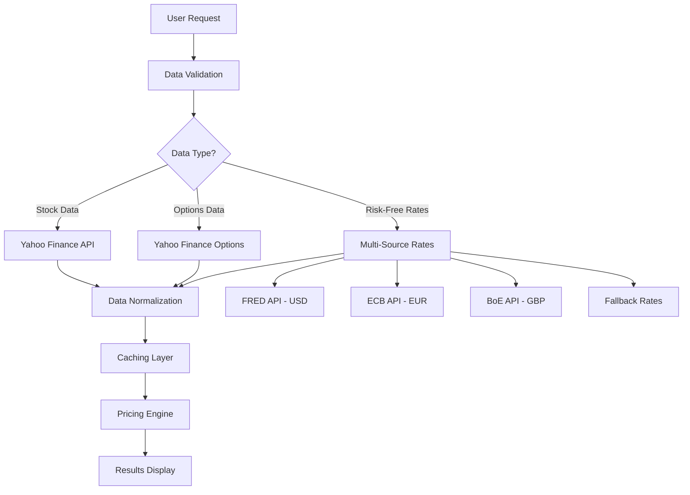

# 📈 CME Equity Options Pricer

> **Professional-grade options pricing and analytics platform with real-time market data, advanced visualization, and multiple pricing models**

A comprehensive, enterprise-ready options pricing application featuring both a sophisticated Streamlit web interface and powerful command-line tools. Built with modular architecture for extensibility and production deployment.

[](https://python.org)
[](https://streamlit.io)
[](https://docker.com)
[](LICENSE)

## 🚀 Quick Start

### 🐳 Docker Deployment (Recommended)

**Windows (PowerShell):**
```powershell
.\docker-run.ps1 run
```

**Linux/macOS (Bash):**
```bash
chmod +x docker-run.sh && ./docker-run.sh run
```

**Manual Docker:**
```bash
docker build -t cme-equity-options-pricer .
docker run -d -p 8501:8501 --name cme-equity-options-pricer cme-equity-options-pricer
```

**🌐 Access Application:** http://localhost:8501

### 💻 Local Development

```bash
# 1. Clone repository
git clone <repository-url>
cd CME_equity_options_pricer

# 2. Install dependencies
pip install -r requirements.txt

# 3. Run Streamlit app
streamlit run app.py

# 4. Or use CLI interface
python cli.py --symbol AAPL --strike 150 --option-type call
```

**📋 Complete Docker Guide:** [DOCKER.md](DOCKER.md)

## 🏗️ Application Architecture

### 📁 **Project Structure**
```
CME_equity_options_pricer/
├── 📱 app.py                        # Main Streamlit web application
├── 💻 cli.py                        # Command-line interface
├── 📋 requirements.txt              # Python dependencies
├── 🐳 Dockerfile                    # Multi-stage Docker build
├── 🔧 docker-compose.yml            # Development orchestration
├── 🚀 docker-compose.prod.yml       # Production deployment
├── 📚 DOCKER.md                     # Complete Docker guide
│
├── 📁 src/                          # Core source code
│   ├── 🧮 models/                   # Financial models & algorithms
│   │   └── pricing.py              # Options pricing engine (BSM, Binomial, MC)
│   ├── 📊 data/                     # Data providers & fetchers
│   │   ├── providers.py            # Market data (Yahoo Finance)
│   │   └── rates.py                # Risk-free rates (FRED, ECB, BoE)
│   ├── 🎨 ui/                       # User interface components
│   │   └── components.py           # Streamlit UI widgets & plots
│   ├── 🛠️ utils/                    # Utilities & helpers
│   │   ├── cache.py                # Caching mechanisms
│   │   ├── formatters.py           # Data formatting utilities
│   │   └── validators.py           # Input validation & sanitization
│   └── 🏗️ core/                     # Core business logic (future)
│
├── ⚙️ config/                       # Application configuration
│   └── settings.py                 # Environment & app settings
│
├── 🧪 tests/                        # Comprehensive test suite
│   ├── test_pricing.py             # Pricing model tests
│   ├── test_enhanced_plots.py      # Visualization tests
│   ├── test_rate_update.py         # Rate provider tests
│   ├── test_options_fix.py         # Options data tests
│   ├── test_plots.py               # Plotting functionality tests
│   ├── test_price_fix.py           # Price validation tests
│   ├── test_strike_filter.py       # Options filtering tests
│   ├── test_final.py               # Integration tests
│   └── validate_fix.py             # Data validation tests
│
├── 💾 backups/                      # Version backups
└── 🐳 docker-run.ps1 / .sh          # Cross-platform Docker management
```

### 🔧 **Design Principles**
- **Separation of Concerns**: Clear boundaries between data, models, UI, and utilities
- **Dependency Injection**: Configurable components for testing and flexibility
- **Type Safety**: Comprehensive type hints for code reliability
- **Error Handling**: Graceful degradation with meaningful error messages
- **Performance**: Intelligent caching and vectorized computations
- **Extensibility**: Plugin-ready architecture for new features

## 🌟 Key Features Overview

### 🎯 **Core Pricing Engine**
- **Multiple Pricing Models**: Black-Scholes-Merton, Binomial Tree, Monte Carlo Simulation
- **Complete Greeks Suite**: Delta, Gamma, Theta, Vega, Rho with real-time calculations
- **Implied Volatility**: Reverse-engineering market expectations with numerical methods
- **American & European Options**: Full support for both exercise styles
- **Dividend Adjustments**: Black-Scholes-Merton with continuous dividend yield

### 📊 **Advanced Analytics & Visualization**
- **4-Tab Interactive Interface**: Organized analysis workflow
- **Enhanced IV Smile Analysis**: Spline curve fitting with R² correlation metrics
- **Theoretical vs Market Overlays**: Real-time price deviation analysis
- **Color-Coded Visualizations**: By moneyness, expiry, option type, and performance
- **Interactive Tooltips**: Comprehensive option details on hover
- **Regression Analysis**: Linear and polynomial fitting with statistical validation
- **Model Comparison**: Side-by-side pricing model performance with RMSE, MAE, MAPE
- **Residual Analysis**: Error distribution and statistical significance testing

### 📈 **Professional Plotting Features**
1. **Price vs IV Analysis**: Enhanced scatter plots with trend lines
2. **Greeks Comparison**: Market vs theoretical Greeks with confidence intervals
3. **Model Performance**: Multi-model comparison with statistical metrics
4. **Sensitivity Analysis**: Parameter impact visualization with heat maps

### 💰 **Real-Time Market Data**
- **Live Stock Quotes**: Yahoo Finance integration with real-time pricing
- **Complete Options Chains**: All strikes, expirations with bid/ask spreads
- **Historical Data**: Price history and volatility calculations
- **Market Hours Detection**: Automatic handling of market closures
- **Data Validation**: Comprehensive error checking and fallback mechanisms

### 🏦 **Multi-Currency Risk-Free Rates**
- **SOFR** (USD): Federal Reserve FRED API integration
- **ESTR** (EUR): European Central Bank direct feed
- **SONIA** (GBP): Bank of England API
- **EONIA** (EUR): Legacy rate with ESTR fallback
- **Automatic Refresh**: Live rate updates with caching
- **Fallback Rates**: Graceful degradation when APIs unavailable

### 🔧 **Enterprise-Ready Features**
- **Modular Architecture**: Clean separation of concerns for maintainability
- **Performance Optimization**: Streamlit caching, vectorized calculations
- **Error Handling**: Comprehensive validation and graceful failure modes
- **Type Safety**: Full type annotations throughout codebase
- **Configuration Management**: Environment-based settings with defaults
- **Logging & Monitoring**: Structured logging for production deployment

## 📦 Installation & Setup

### 🔧 **Prerequisites**
- **Python**: 3.8 or higher (Python 3.13 recommended)
- **pip**: Package manager (included with Python)
- **Docker**: Optional, for containerized deployment
- **Git**: For cloning the repository

### 🚀 **Installation Methods**

#### Method 1: Standard Python Installation
```bash
# 1. Clone repository
git clone https://github.com/vieee/CME_equity_options_pricer.git
cd CME_equity_options_pricer

# 2. Create virtual environment (recommended)
python -m venv .venv

# 3. Activate virtual environment
# Windows:
.venv\Scripts\activate
# Linux/macOS:
source .venv/bin/activate

# 4. Install dependencies
pip install -r requirements.txt

# 5. Run application
streamlit run app.py
```

#### Method 2: Docker Installation (Recommended for Production)
```bash
# 1. Clone repository
git clone https://github.com/vieee/CME_equity_options_pricer.git
cd CME_equity_options_pricer

# 2. Build and run with Docker
docker build -t cme-equity-options-pricer .
docker run -p 8501:8501 cme-equity-options-pricer

# Or use management scripts:
# Windows: .\docker-run.ps1 run
# Linux/macOS: ./docker-run.sh run
```

### 🔑 **API Configuration (Optional but Recommended)**

#### FRED API Key (For US Risk-Free Rates)
```bash
# Get free API key from: https://fred.stlouisfed.org/docs/api/api_key.html

# Method 1: Environment Variable
export FRED_API_KEY="your_fred_api_key_here"

# Method 2: .env File
echo "FRED_API_KEY=your_fred_api_key_here" > .env

# Method 3: Docker Environment
docker run -e FRED_API_KEY="your_key" -p 8501:8501 cme-equity-options-pricer
```

#### Alpha Vantage API Key (Optional Enhancement)
```bash
# For additional data sources (optional)
export ALPHA_VANTAGE_API_KEY="your_alpha_vantage_key"
```

### 🔧 **Configuration Options**

Edit `config/settings.py` for customization:
```python
# API Settings
FRED_API_KEY = "your_fred_key"
REQUEST_TIMEOUT = 30
MAX_RETRIES = 3

# Pricing Model Defaults
DEFAULT_RISK_FREE_RATE = 0.05
DEFAULT_VOLATILITY = 0.25
MONTE_CARLO_SIMULATIONS = 10000

# UI Preferences
MAX_OPTIONS_DISPLAY = 500
DECIMAL_PLACES = 4
```

## 🖥️ Usage Guide

### 🌐 **Web Application Interface**

#### Starting the Application
```bash
streamlit run app.py
```
**Access at:** `http://localhost:8501`

#### Interface Overview
The Streamlit interface features four main tabs:

**1. 📊 Price vs IV Analysis**
- Interactive scatter plots of option prices vs implied volatility
- Color coding by moneyness, expiry, and option type
- Spline curve fitting with R² correlation metrics
- Enhanced tooltips with comprehensive option details
- Filtering by option type, expiry range, and moneyness

**2. 📈 Greeks Comparison** 
- Market vs theoretical Greeks visualization
- Delta, Gamma, Theta, Vega, Rho comparative analysis
- Confidence intervals and statistical significance
- Interactive overlays with deviation metrics
- Color-coded performance indicators

**3. 🔍 Model Comparison**
- Side-by-side pricing model performance
- Black-Scholes vs Binomial vs Monte Carlo
- Statistical metrics: RMSE, MAE, MAPE, Correlation
- Residual analysis and error distribution
- Model selection recommendations

**4. 🎯 Sensitivity Analysis**
- Parameter impact visualization
- Heat maps for price sensitivity
- Scenario analysis with parameter variations
- Risk metrics and value-at-risk calculations

#### Key Features in Web Interface
- **Real-time Data**: Live market quotes and options chains
- **Interactive Charts**: Plotly-powered visualizations with zoom, pan, select
- **Export Options**: Download charts as PNG/HTML, data as CSV
- **Responsive Design**: Mobile and desktop optimized
- **Professional Themes**: Dark/light mode support

### 💻 **Command Line Interface (CLI)**

#### Basic Usage
```bash
# Get help
python cli.py --help

# Basic option pricing
python cli.py AAPL --strike 150 --option-type call

# Comprehensive analysis
python cli.py AAPL --strike 150 --expiry 2024-12-20 --option-type put --rate 0.045 --volatility 0.30
```

#### CLI Features & Examples

**1. Options Chain Analysis**
```bash
# Display complete options chain
python cli.py AAPL --show-chain

# Filter by expiry
python cli.py AAPL --show-chain --expiry 2024-03-15
```

**2. Quick Price Lookup**
```bash
# Get theoretical price only (for scripting)
python cli.py AAPL --strike 150 --expiry 2024-12-20 --price-only

# Output: 12.45
```

**3. Custom Parameters**
```bash
# Use custom risk-free rate and volatility
python cli.py MSFT --strike 300 --expiry 2024-06-21 --rate 0.0525 --volatility 0.35

# European vs American style
python cli.py TSLA --strike 200 --expiry 2024-09-20 --style european
```

**4. Batch Processing**
```bash
# Process multiple symbols
for symbol in AAPL MSFT GOOGL; do
    python cli.py $symbol --strike 150 --price-only
done
```

### 🐍 **Python API Integration**

#### Basic Integration
```python
from src.models.pricing import OptionsPricingEngine
from src.data.providers import MarketDataProvider
from src.data.rates import get_risk_free_rates

# Initialize components
pricing_engine = OptionsPricingEngine()
market_provider = MarketDataProvider()
rates_provider = get_risk_free_rates()

# Get live market data
market_data = market_provider.get_complete_market_data("AAPL")
current_price = market_data['current_price']
options_chain = market_data['options_data']

# Calculate theoretical prices
call_price = pricing_engine.black_scholes_call(
    S=current_price, K=150, T=0.25, r=0.05, sigma=0.25
)

put_price = pricing_engine.black_scholes_put(
    S=current_price, K=150, T=0.25, r=0.05, sigma=0.25
)
```

#### Advanced Usage
```python
# Calculate complete Greeks
greeks = pricing_engine.calculate_greeks(
    S=current_price, K=150, T=0.25, r=0.05, sigma=0.25, option_type='call'
)

print(f"Delta: {greeks['delta']:.4f}")
print(f"Gamma: {greeks['gamma']:.4f}")
print(f"Theta: {greeks['theta']:.4f}")
print(f"Vega: {greeks['vega']:.4f}")
print(f"Rho: {greeks['rho']:.4f}")

# Implied volatility calculation
market_price = 12.50
implied_vol = pricing_engine.implied_volatility(
    market_price=market_price, S=current_price, K=150, T=0.25, r=0.05, option_type='call'
)

# Monte Carlo simulation
mc_price = pricing_engine.monte_carlo_option_price(
    S=current_price, K=150, T=0.25, r=0.05, sigma=0.25, 
    option_type='call', simulations=100000
)

# Binomial tree pricing
binomial_price = pricing_engine.binomial_tree_option_price(
    S=current_price, K=150, T=0.25, r=0.05, sigma=0.25, 
    option_type='call', steps=100, american=True
)
```

#### Custom Data Integration
```python
# Use custom data sources
from src.utils.validators import DataValidator
from src.utils.formatters import DataFormatter

# Validate and format custom data
if DataValidator.validate_symbol("CUSTOM"):
    formatted_data = DataFormatter.format_options_data(custom_options_data)
    
    # Process with pricing engine
    results = pricing_engine.analyze_options_chain(formatted_data)
```

### 🔄 **Workflow Examples**

#### Scenario 1: Daily Options Analysis
```python
# Morning routine - analyze key positions
symbols = ['SPY', 'QQQ', 'AAPL', 'MSFT']
strikes = [current_price * 0.95, current_price, current_price * 1.05]

for symbol in symbols:
    market_data = market_provider.get_complete_market_data(symbol)
    
    for strike in strikes:
        call_greeks = pricing_engine.calculate_greeks(
            S=market_data['current_price'], K=strike, T=0.25, 
            r=rates_provider.get_rate('USD'), sigma=0.25, option_type='call'
        )
        
        print(f"{symbol} ${strike} Call Delta: {call_greeks['delta']:.3f}")
```

#### Scenario 2: Risk Management
```python
# Portfolio Greeks calculation
portfolio_delta = 0
portfolio_gamma = 0

for position in portfolio:
    greeks = pricing_engine.calculate_greeks(**position.params)
    portfolio_delta += greeks['delta'] * position.quantity
    portfolio_gamma += greeks['gamma'] * position.quantity

print(f"Portfolio Delta: {portfolio_delta:.2f}")
print(f"Portfolio Gamma: {portfolio_gamma:.2f}")
```

## 🧪 Testing & Quality Assurance

### 🔍 **Comprehensive Test Suite**

#### Running Tests
```bash
# Run all tests
python -m pytest tests/ -v

# Run specific test files
python -m pytest tests/test_pricing.py -v
python -m pytest tests/test_enhanced_plots.py -v

# Run with coverage report
python -m pytest tests/ --cov=src --cov-report=html

# Run individual test modules
python tests/test_pricing.py
python tests/validate_fix.py
```

#### Test Coverage Areas

**📊 Pricing Model Tests** (`test_pricing.py`)
- Black-Scholes-Merton formula validation
- Put-call parity verification 
- Greeks calculations accuracy
- Boundary condition testing
- Numerical stability checks

**📈 Visualization Tests** (`test_enhanced_plots.py`, `test_plots.py`)
- Plot generation and rendering
- Interactive features functionality
- Color coding accuracy
- Data visualization integrity
- Chart export capabilities

**🔧 Data Validation Tests** (`test_options_fix.py`, `validate_fix.py`)
- Input parameter validation
- Market data integrity checks
- Error handling robustness
- Edge case management
- Data format consistency

**💰 Rate Provider Tests** (`test_rate_update.py`)
- API connectivity and fallback
- Rate calculation accuracy
- Currency conversion logic
- Cache functionality
- Error recovery mechanisms

**🎯 Integration Tests** (`test_final.py`)
- End-to-end workflow validation
- Component interaction testing
- Performance benchmarking
- Cross-platform compatibility
- Production scenario simulation

### ✅ **Quality Metrics & Validation**

#### Automated Checks
- **Type Safety**: mypy static type checking
- **Code Quality**: flake8 linting and formatting
- **Security**: bandit security analysis
- **Performance**: profiling with memory and CPU monitoring
- **Documentation**: docstring coverage validation

#### Financial Model Validation
```bash
# Validate pricing models against known benchmarks
python tests/test_pricing.py --benchmark

# Verify put-call parity holds
python tests/validate_fix.py --parity-check

# Test Greeks numerical accuracy
python tests/test_pricing.py --greeks-validation
```

#### Data Integrity Checks
```bash
# Validate market data quality
python tests/test_options_fix.py --data-quality

# Test API connectivity and failover
python tests/test_rate_update.py --connectivity

# Verify price calculation consistency
python tests/test_price_fix.py --consistency-check
```

### 🎯 **Test-Driven Development Examples**

#### Adding New Pricing Models
```python
# tests/test_new_model.py
def test_new_pricing_model():
    """Test new pricing model implementation"""
    engine = OptionsPricingEngine()
    
    # Test known analytical solutions
    expected_price = 10.45  # Known theoretical value
    calculated_price = engine.new_model_price(
        S=100, K=105, T=0.25, r=0.05, sigma=0.20
    )
    
    assert abs(calculated_price - expected_price) < 0.01
    
    # Test edge cases
    assert engine.new_model_price(S=100, K=100, T=0, r=0.05, sigma=0.20) >= 0
    
    # Test Greeks consistency
    greeks = engine.calculate_greeks_new_model(...)
    assert 0 <= greeks['delta'] <= 1  # Call delta bounds
```

#### Validating Visualization Features
```python
# tests/test_visualization.py
def test_enhanced_plotting():
    """Test enhanced plotting features"""
    import plotly.graph_objects as go
    
    # Generate test data
    test_options_df = create_test_options_data()
    
    # Test plot generation
    fig = StreamlitComponents._create_enhanced_iv_plot(
        test_options_df, current_price=100, color_by='moneyness'
    )
    
    assert isinstance(fig, go.Figure)
    assert len(fig.data) > 0  # Has plot traces
    assert fig.layout.title.text  # Has title
    
    # Test interactive features
    assert fig.layout.hovermode == 'closest'
    assert fig.layout.showlegend == True
```

## ⚙️ Configuration & Customization

### 🔧 **Application Settings**

#### Core Configuration (`config/settings.py`)
```python
# API Configuration
FRED_API_KEY = "your_fred_api_key"          # US risk-free rates
ALPHA_VANTAGE_API_KEY = "your_av_key"       # Alternative data source
REQUEST_TIMEOUT = 30                        # API request timeout (seconds)
MAX_RETRIES = 3                            # API retry attempts

# Pricing Model Defaults
DEFAULT_RISK_FREE_RATE = 0.05              # 5% annual rate
DEFAULT_VOLATILITY = 0.25                  # 25% annual volatility
MONTE_CARLO_SIMULATIONS = 10000            # MC simulation count
BINOMIAL_TREE_STEPS = 100                  # Binomial tree steps

# UI Preferences  
MAX_OPTIONS_DISPLAY = 500                  # Maximum options shown
DECIMAL_PLACES = 4                         # Price precision
PAGE_LAYOUT = "wide"                       # Streamlit layout
ENABLE_DARK_MODE = True                    # UI theme preference

# Performance Settings
CACHE_TTL_SECONDS = 300                    # Cache expiration (5 minutes)
ENABLE_MULTITHREADING = True               # Parallel processing
MAX_MEMORY_USAGE_MB = 1024                 # Memory limit
```

#### Environment Variables
```bash
# API Keys
export FRED_API_KEY="your_fred_key"
export ALPHA_VANTAGE_API_KEY="your_av_key"

# Application Settings
export DEBUG=True                          # Enable debug mode
export LOG_LEVEL=INFO                      # Logging verbosity
export CACHE_BACKEND=redis                 # Cache backend (redis/memory)
export DATABASE_URL=postgresql://...       # Optional database

# Production Settings
export STREAMLIT_SERVER_PORT=8501
export STREAMLIT_SERVER_ADDRESS=0.0.0.0
export STREAMLIT_BROWSER_GATHER_USAGE_STATS=false
```

### 🎨 **UI Customization**

#### Custom Themes
```python
# config/themes.py
DARK_THEME = {
    'background_color': '#0E1117',
    'secondary_background': '#262730',
    'text_color': '#FAFAFA',
    'accent_color': '#FF6B6B'
}

LIGHT_THEME = {
    'background_color': '#FFFFFF',
    'secondary_background': '#F0F2F6',
    'text_color': '#262730',
    'accent_color': '#1F77B4'
}
```

#### Custom Plotting Styles
```python
# Custom color schemes for visualizations
MONEYNESS_COLORS = {
    'deep_otm': '#FF4444',    # Deep Out of Money
    'otm': '#FF8888',         # Out of Money  
    'near_atm': '#FFAA00',    # Near At Money
    'atm': '#00AA00',         # At Money
    'itm': '#0088FF',         # In the Money
    'deep_itm': '#0044FF'     # Deep In Money
}

EXPIRY_COLORS = {
    'weekly': '#FF6B6B',      # < 1 week
    'monthly': '#4ECDC4',     # 1 week - 1 month
    'quarterly': '#45B7D1',   # 1-3 months
    'yearly': '#96CEB4'       # > 3 months
}
```

### 🔌 **Extending Functionality**

#### Adding New Pricing Models
```python
# src/models/custom_model.py
class CustomPricingModel:
    """Template for custom pricing model implementation"""
    
    def __init__(self, **params):
        self.params = params
    
    def calculate_option_price(self, S, K, T, r, sigma, option_type='call'):
        """
        Implement your custom pricing logic here
        
        Args:
            S: Current stock price
            K: Strike price  
            T: Time to expiration
            r: Risk-free rate
            sigma: Volatility
            option_type: 'call' or 'put'
            
        Returns:
            Option price (float)
        """
        # Your implementation here
        pass
    
    def calculate_greeks(self, S, K, T, r, sigma, option_type='call'):
        """Calculate option Greeks"""
        # Your Greeks implementation here
        pass

# Register in main pricing engine
from src.models.pricing import OptionsPricingEngine

# Extend the main engine
OptionsPricingEngine.register_model('custom', CustomPricingModel)
```

#### Adding New Data Providers
```python
# src/data/custom_provider.py
class CustomDataProvider:
    """Template for custom data provider"""
    
    def __init__(self, api_key=None):
        self.api_key = api_key
    
    def get_stock_data(self, symbol):
        """Fetch stock data from custom source"""
        # Your implementation here
        pass
    
    def get_options_data(self, symbol):
        """Fetch options data from custom source"""
        # Your implementation here
        pass

# Register in provider factory
from src.data.providers import DataProviderFactory

DataProviderFactory.register('custom', CustomDataProvider)
```

#### Custom UI Components
```python
# src/ui/custom_components.py
import streamlit as st
import plotly.graph_objects as go

class CustomStreamlitComponents:
    """Custom UI components for specialized analysis"""
    
    @staticmethod
    def render_risk_metrics_dashboard(portfolio_data):
        """Custom risk metrics visualization"""
        col1, col2, col3 = st.columns(3)
        
        with col1:
            st.metric("Portfolio Delta", f"{portfolio_data['delta']:.2f}")
        
        with col2:
            st.metric("Portfolio Gamma", f"{portfolio_data['gamma']:.2f}")
            
        with col3:
            st.metric("Portfolio Theta", f"{portfolio_data['theta']:.2f}")
    
    @staticmethod
    def render_custom_analysis_plot(data, analysis_type):
        """Custom analysis visualization"""
        fig = go.Figure()
        
        # Your custom plotting logic here
        
        st.plotly_chart(fig, use_container_width=True)
```

### 🔧 **Performance Optimization**

#### Caching Strategies
```python
# src/utils/custom_cache.py
import streamlit as st
from functools import wraps
import redis

# Redis cache for production
redis_client = redis.Redis(host='localhost', port=6379, db=0)

def redis_cache(expiry=300):
    """Custom Redis caching decorator"""
    def decorator(func):
        @wraps(func)
        def wrapper(*args, **kwargs):
            cache_key = f"{func.__name__}:{hash(str(args) + str(kwargs))}"
            
            # Try to get from cache
            cached = redis_client.get(cache_key)
            if cached:
                return pickle.loads(cached)
            
            # Calculate and cache result
            result = func(*args, **kwargs)
            redis_client.setex(cache_key, expiry, pickle.dumps(result))
            return result
        return wrapper
    return decorator

# Usage in pricing models
@redis_cache(expiry=600)  # 10 minute cache
def expensive_monte_carlo_calculation(S, K, T, r, sigma, simulations):
    """Cached Monte Carlo calculation"""
    # Your expensive calculation here
    pass
```

#### Parallel Processing
```python
# src/utils/parallel.py
import concurrent.futures
import numpy as np

def parallel_options_pricing(options_list, pricing_func, max_workers=4):
    """Process multiple options in parallel"""
    with concurrent.futures.ThreadPoolExecutor(max_workers=max_workers) as executor:
        futures = {
            executor.submit(pricing_func, **option_params): option_params 
            for option_params in options_list
        }
        
        results = []
        for future in concurrent.futures.as_completed(futures):
            try:
                result = future.result()
                results.append(result)
            except Exception as e:
                print(f"Error processing option: {e}")
                
        return results
```

## 📊 Data Sources & APIs

### 💹 **Market Data Providers**

#### Primary Data Source: Yahoo Finance (yfinance)
- **Coverage**: Global equities, ETFs, indices, options
- **Real-time Data**: Live quotes during market hours
- **Historical Data**: Daily, weekly, monthly price history
- **Options Chains**: Complete strike/expiry matrix with Greeks
- **Cost**: Free with rate limits
- **Reliability**: High availability, community-maintained

```python
# Example usage
import yfinance as yf

# Get stock data
ticker = yf.Ticker("AAPL")
stock_info = ticker.info
options_dates = ticker.options

# Get options chain
options_chain = ticker.option_chain('2024-12-20')
calls = options_chain.calls
puts = options_chain.puts
```

#### Secondary Data Source: Alpha Vantage (Optional)
- **Coverage**: Stocks, forex, cryptocurrencies
- **Enhanced Data**: Fundamental data, technical indicators
- **API Key Required**: Free tier available
- **Use Case**: Backup data source, enhanced analytics

### 🏦 **Risk-Free Rate Providers**

#### 1. Federal Reserve Economic Data (FRED) - USD Rates
- **Source**: Federal Reserve Bank of St. Louis
- **Rate**: SOFR (Secured Overnight Financing Rate)
- **API**: RESTful with JSON responses
- **Free Tier**: 1000 requests/day
- **Coverage**: US Treasury rates, economic indicators

```python
# Example FRED API usage
import requests

fred_api_key = "your_fred_api_key"
url = f"https://api.stlouisfed.org/fred/series/observations"
params = {
    'series_id': 'SOFR',
    'api_key': fred_api_key,
    'file_type': 'json',
    'limit': 1,
    'sort_order': 'desc'
}

response = requests.get(url, params=params)
sofr_rate = response.json()['observations'][0]['value']
```

#### 2. European Central Bank (ECB) - EUR Rates  
- **Source**: European Central Bank Statistical Data Warehouse
- **Rate**: ESTR (Euro Short-Term Rate)
- **API**: XML/CSV data feeds
- **Cost**: Free public access
- **Coverage**: Eurozone rates, monetary policy data

#### 3. Bank of England (BoE) - GBP Rates
- **Source**: Bank of England Database
- **Rate**: SONIA (Sterling Overnight Index Average)  
- **API**: RESTful JSON API
- **Cost**: Free public access
- **Coverage**: UK rates, financial stability data

#### 4. Fallback Mechanisms
```python
# Automatic fallback rates when APIs unavailable
FALLBACK_RATES = {
    'USD': 0.0525,  # Current SOFR approximation
    'EUR': 0.0400,  # Current ESTR approximation  
    'GBP': 0.0515,  # Current SONIA approximation
    'CAD': 0.0500,  # Bank of Canada rate
    'JPY': 0.0010,  # Bank of Japan rate
    'AUD': 0.0435,  # Reserve Bank of Australia rate
    'CHF': 0.0125,  # Swiss National Bank rate
}
```

### 🔄 **Data Flow Architecture**



### 📈 **Data Quality & Validation**

#### Market Data Quality Checks
```python
# src/utils/data_quality.py
class DataQualityValidator:
    """Validate market data quality and integrity"""
    
    @staticmethod
    def validate_stock_data(stock_data):
        """Validate stock price data"""
        checks = {
            'price_positive': stock_data['currentPrice'] > 0,
            'volume_reasonable': stock_data['volume'] >= 0,
            'market_cap_valid': stock_data.get('marketCap', 0) > 0,
            'pe_ratio_reasonable': 0 < stock_data.get('forwardPE', 0) < 1000
        }
        return all(checks.values()), checks
    
    @staticmethod  
    def validate_options_data(options_df):
        """Validate options chain data"""
        checks = {
            'prices_positive': (options_df['lastPrice'] > 0).all(),
            'iv_reasonable': (0 < options_df['impliedVolatility']).all() & 
                           (options_df['impliedVolatility'] < 5).all(),
            'spreads_reasonable': (options_df['bid'] <= options_df['ask']).all(),
            'volume_non_negative': (options_df['volume'] >= 0).all()
        }
        return all(checks.values()), checks
```

#### Rate Data Validation
```python
# Validate risk-free rates
def validate_risk_free_rate(rate, currency):
    """Validate risk-free rate reasonableness"""
    # Historical bounds for different currencies
    bounds = {
        'USD': (-0.01, 0.15),  # -1% to 15%
        'EUR': (-0.01, 0.10),  # -1% to 10%
        'GBP': (-0.01, 0.15),  # -1% to 15%
        'JPY': (-0.01, 0.05),  # -1% to 5%
    }
    
    lower, upper = bounds.get(currency, (-0.02, 0.20))
    return lower <= rate <= upper
```

### 🔧 **API Management & Best Practices**

#### Rate Limiting & Error Handling
```python
# src/data/api_manager.py
import time
import requests
from functools import wraps

class APIManager:
    """Manage API requests with rate limiting and error handling"""
    
    def __init__(self):
        self.last_request_time = {}
        self.request_counts = {}
    
    def rate_limited_request(self, url, min_interval=1.0):
        """Make rate-limited API request"""
        now = time.time()
        
        # Enforce minimum interval between requests
        if url in self.last_request_time:
            elapsed = now - self.last_request_time[url]
            if elapsed < min_interval:
                time.sleep(min_interval - elapsed)
        
        try:
            response = requests.get(url, timeout=30)
            response.raise_for_status()
            self.last_request_time[url] = time.time()
            return response.json()
        
        except requests.exceptions.RequestException as e:
            print(f"API request failed: {e}")
            return None
```

#### Caching Strategy
```python
# Multi-tier caching for optimal performance
CACHE_STRATEGY = {
    'stock_quotes': 60,      # 1 minute for live quotes
    'options_chains': 300,   # 5 minutes for options data
    'risk_free_rates': 3600, # 1 hour for rates
    'historical_data': 86400 # 24 hours for historical data
}
```

### 🌐 **International Market Support**

#### Supported Exchanges
- **US**: NYSE, NASDAQ, AMEX
- **Canada**: TSX, TSX-V  
- **Europe**: LSE, Euronext, XETRA
- **Asia-Pacific**: ASX, TSE, HKEX (via yfinance)

#### Currency & Timezone Handling
```python
# Automatic currency and timezone conversion
MARKET_TIMEZONES = {
    'NYSE': 'America/New_York',
    'NASDAQ': 'America/New_York', 
    'LSE': 'Europe/London',
    'TSE': 'Asia/Tokyo',
    'ASX': 'Australia/Sydney'
}

def convert_to_local_timezone(utc_time, exchange):
    """Convert UTC time to local exchange timezone"""
    import pytz
    utc = pytz.UTC
    local_tz = pytz.timezone(MARKET_TIMEZONES[exchange])
    return utc_time.replace(tzinfo=utc).astimezone(local_tz)
```

## 🔧 Development & Contributing

### 🏗️ **Development Setup**

#### Local Development Environment
```bash
# 1. Fork and clone repository
git clone https://github.com/yourusername/CME_equity_options_pricer.git
cd CME_equity_options_pricer

# 2. Create development environment
python -m venv .venv
source .venv/bin/activate  # Linux/macOS
# .venv\Scripts\activate   # Windows

# 3. Install development dependencies
pip install -r requirements.txt
pip install -r requirements-dev.txt  # If available

# 4. Install pre-commit hooks
pre-commit install

# 5. Run development server
streamlit run app.py --server.runOnSave true
```

#### Development Dependencies
```bash
# Testing frameworks
pytest>=7.0.0
pytest-cov>=4.0.0
pytest-mock>=3.10.0

# Code quality tools
black>=23.0.0          # Code formatting
flake8>=6.0.0          # Linting
mypy>=1.0.0            # Type checking
bandit>=1.7.0          # Security analysis

# Development utilities
pre-commit>=3.0.0      # Git hooks
jupyter>=1.0.0         # Notebook development
matplotlib>=3.7.0      # Additional plotting
seaborn>=0.12.0        # Statistical visualization
```

### 📝 **Code Standards & Guidelines**

#### Python Style Guide
```python
# Follow PEP 8 with these specifics:

# 1. Line length: 88 characters (Black default)
# 2. String quotes: Double quotes preferred
# 3. Import organization:
# Standard library imports
import os
import sys
from datetime import datetime

# Third-party imports  
import numpy as np
import pandas as pd
import streamlit as st

# Local imports
from src.models.pricing import OptionsPricingEngine
from src.utils.validators import DataValidator

# 4. Type hints for all functions
def calculate_option_price(
    current_price: float,
    strike_price: float,
    time_to_expiry: float,
    risk_free_rate: float,
    volatility: float,
    option_type: str = "call"
) -> float:
    """
    Calculate theoretical option price using Black-Scholes model.
    
    Args:
        current_price: Current underlying asset price
        strike_price: Option strike price
        time_to_expiry: Time to expiration in years
        risk_free_rate: Risk-free interest rate
        volatility: Implied volatility
        option_type: "call" or "put"
        
    Returns:
        Theoretical option price
        
    Raises:
        ValueError: If invalid parameters provided
    """
    # Implementation here
    pass
```

#### Documentation Standards
```python
# Comprehensive docstrings for all public methods
class OptionsPricingEngine:
    """
    Advanced options pricing engine with multiple models.
    
    This class provides implementations of various option pricing models
    including Black-Scholes-Merton, Binomial Trees, and Monte Carlo
    simulation. It also calculates Greeks and implied volatility.
    
    Attributes:
        default_risk_free_rate: Default rate used when not specified
        monte_carlo_simulations: Number of MC simulations to run
        
    Example:
        >>> engine = OptionsPricingEngine()
        >>> price = engine.black_scholes_call(100, 105, 0.25, 0.05, 0.20)
        >>> print(f"Call option price: ${price:.2f}")
    """
    
    def __init__(self, default_risk_free_rate: float = 0.05):
        """Initialize pricing engine with default parameters."""
        self.default_risk_free_rate = default_risk_free_rate
```

### 🧪 **Testing Guidelines**

#### Test Structure
```python
# tests/test_example.py
import pytest
import numpy as np
from src.models.pricing import OptionsPricingEngine

class TestOptionsPricingEngine:
    """Test suite for OptionsPricingEngine class."""
    
    @pytest.fixture
    def pricing_engine(self):
        """Create a pricing engine instance for testing."""
        return OptionsPricingEngine(default_risk_free_rate=0.05)
    
    @pytest.fixture
    def sample_option_params(self):
        """Standard option parameters for testing."""
        return {
            'S': 100.0,    # Current price
            'K': 105.0,    # Strike price
            'T': 0.25,     # 3 months to expiry
            'r': 0.05,     # 5% risk-free rate
            'sigma': 0.20  # 20% volatility
        }
    
    def test_black_scholes_call_price(self, pricing_engine, sample_option_params):
        """Test Black-Scholes call option pricing."""
        price = pricing_engine.black_scholes_call(**sample_option_params)
        
        # Test price is positive
        assert price > 0
        
        # Test price is reasonable (not more than current price)
        assert price <= sample_option_params['S']
        
        # Test against known analytical result (if available)
        expected_price = 2.78  # Known theoretical value
        assert abs(price - expected_price) < 0.01
    
    def test_put_call_parity(self, pricing_engine, sample_option_params):
        """Test that put-call parity holds."""
        call_price = pricing_engine.black_scholes_call(**sample_option_params)
        put_price = pricing_engine.black_scholes_put(**sample_option_params)
        
        # Put-call parity: C - P = S - K*e^(-rT)
        S, K, T, r = (sample_option_params[key] for key in ['S', 'K', 'T', 'r'])
        parity_diff = call_price - put_price - (S - K * np.exp(-r * T))
        
        assert abs(parity_diff) < 1e-6  # Should be very close to zero
    
    @pytest.mark.parametrize("option_type,expected_delta_range", [
        ("call", (0, 1)),
        ("put", (-1, 0))
    ])
    def test_delta_bounds(self, pricing_engine, sample_option_params, option_type, expected_delta_range):
        """Test that delta values are within expected bounds."""
        greeks = pricing_engine.calculate_greeks(
            option_type=option_type, **sample_option_params
        )
        
        min_delta, max_delta = expected_delta_range
        assert min_delta <= greeks['delta'] <= max_delta
```

#### Test Categories
1. **Unit Tests**: Individual function/method testing
2. **Integration Tests**: Component interaction testing  
3. **Regression Tests**: Ensure existing functionality remains intact
4. **Performance Tests**: Benchmark critical path performance
5. **End-to-End Tests**: Full workflow validation

### 🚀 **Contributing Workflow**

#### 1. Issue Creation
```markdown
# Feature Request Template
**Feature Description**: Brief description of the new feature

**Use Case**: Why is this feature needed?

**Proposed Implementation**: High-level approach

**Acceptance Criteria**: 
- [ ] Criterion 1
- [ ] Criterion 2
- [ ] Tests written and passing
- [ ] Documentation updated

**Additional Context**: Any other relevant information
```

#### 2. Development Process
```bash
# 1. Create feature branch
git checkout -b feature/new-pricing-model

# 2. Implement changes with tests
# - Write failing tests first (TDD)
# - Implement feature to make tests pass
# - Refactor and optimize

# 3. Run quality checks
black src/ tests/                    # Format code
flake8 src/ tests/                   # Lint code  
mypy src/                           # Type check
pytest tests/ -v --cov=src          # Run tests with coverage
bandit -r src/                      # Security scan

# 4. Commit changes
git add .
git commit -m "feat: add new Monte Carlo pricing model

- Implement path-dependent option pricing
- Add Asian and barrier option support  
- Include comprehensive test suite
- Update documentation with examples"

# 5. Push and create pull request
git push origin feature/new-pricing-model
```

#### 3. Pull Request Guidelines
```markdown
# Pull Request Template

## Description
Brief description of changes made

## Type of Change
- [ ] Bug fix (non-breaking change which fixes an issue)
- [ ] New feature (non-breaking change which adds functionality)
- [ ] Breaking change (fix or feature that would cause existing functionality to not work as expected)
- [ ] Documentation update

## Testing
- [ ] Unit tests pass
- [ ] Integration tests pass
- [ ] Manual testing completed
- [ ] Performance impact assessed

## Checklist
- [ ] My code follows the style guidelines of this project
- [ ] I have performed a self-review of my own code
- [ ] I have commented my code, particularly in hard-to-understand areas
- [ ] I have made corresponding changes to the documentation
- [ ] My changes generate no new warnings
- [ ] I have added tests that prove my fix is effective or that my feature works
- [ ] New and existing unit tests pass locally with my changes
```

### 🎯 **Feature Development Examples**

#### Adding a New Pricing Model
```python
# 1. Create model file: src/models/heston_model.py
class HestonModel:
    """Heston stochastic volatility model implementation."""
    
    def __init__(self, kappa: float, theta: float, sigma: float, rho: float):
        self.kappa = kappa  # Mean reversion rate
        self.theta = theta  # Long-term variance
        self.sigma = sigma  # Volatility of volatility
        self.rho = rho      # Correlation coefficient
    
    def option_price(self, S: float, K: float, T: float, r: float, v0: float) -> float:
        """Calculate option price using Heston model."""
        # Implementation using characteristic functions
        pass

# 2. Add tests: tests/test_heston_model.py
def test_heston_call_price():
    """Test Heston model call option pricing."""
    model = HestonModel(kappa=2.0, theta=0.04, sigma=0.3, rho=-0.7)
    price = model.option_price(S=100, K=100, T=1.0, r=0.05, v0=0.04)
    assert price > 0

# 3. Integrate into main engine: src/models/pricing.py
def heston_option_price(self, S, K, T, r, v0, **heston_params):
    """Price option using Heston stochastic volatility model."""
    model = HestonModel(**heston_params)
    return model.option_price(S, K, T, r, v0)
```

#### Adding New Visualization Features
```python
# 1. Create component: src/ui/advanced_plots.py
def render_volatility_surface(options_data: pd.DataFrame):
    """Render 3D implied volatility surface."""
    fig = go.Figure(data=[go.Surface(
        x=options_data['strike'],
        y=options_data['days_to_expiry'], 
        z=options_data['implied_volatility'],
        colorscale='Viridis'
    )])
    
    fig.update_layout(
        title='Implied Volatility Surface',
        scene=dict(
            xaxis_title='Strike Price',
            yaxis_title='Days to Expiry',
            zaxis_title='Implied Volatility'
        )
    )
    
    st.plotly_chart(fig, use_container_width=True)

# 2. Add to main UI: src/ui/components.py
def render_advanced_analysis_tab(self, options_df: pd.DataFrame):
    """Render advanced analysis tab with volatility surface."""
    st.header("Advanced Analysis")
    
    if st.checkbox("Show Volatility Surface"):
        render_volatility_surface(options_df)
```

### 📋 **Release Process**

#### Version Management
```bash
# Semantic versioning: MAJOR.MINOR.PATCH
# MAJOR: Breaking changes
# MINOR: New features (backward compatible)  
# PATCH: Bug fixes (backward compatible)

# Example: v2.1.3
# 2 = Major version
# 1 = Minor version  
# 3 = Patch version
```

#### Release Checklist
- [ ] All tests passing
- [ ] Documentation updated
- [ ] Version number bumped
- [ ] CHANGELOG.md updated
- [ ] Docker images built and tested
- [ ] Performance benchmarks run
- [ ] Security scan completed
- [ ] Backward compatibility verified

## 📈 Advanced Features & Use Cases

### 🎯 **Professional Trading Applications**

#### Portfolio Risk Management
```python
# Calculate portfolio-level Greeks
class PortfolioManager:
    """Manage options portfolio risk metrics."""
    
    def __init__(self, pricing_engine):
        self.pricing_engine = pricing_engine
        self.positions = []
    
    def add_position(self, symbol, option_type, strike, expiry, quantity, entry_price):
        """Add option position to portfolio."""
        position = {
            'symbol': symbol,
            'option_type': option_type,
            'strike': strike,
            'expiry': expiry,
            'quantity': quantity,
            'entry_price': entry_price
        }
        self.positions.append(position)
    
    def calculate_portfolio_greeks(self, market_data):
        """Calculate aggregate portfolio Greeks."""
        portfolio_greeks = {'delta': 0, 'gamma': 0, 'theta': 0, 'vega': 0, 'rho': 0}
        
        for position in self.positions:
            # Get current market data for position
            current_price = market_data[position['symbol']]['current_price']
            
            # Calculate Greeks for individual position
            greeks = self.pricing_engine.calculate_greeks(
                S=current_price,
                K=position['strike'],
                T=self._calculate_time_to_expiry(position['expiry']),
                r=0.05,  # Use current risk-free rate
                sigma=0.25,  # Use current implied volatility
                option_type=position['option_type']
            )
            
            # Aggregate by position size
            for greek in portfolio_greeks:
                portfolio_greeks[greek] += greeks[greek] * position['quantity']
        
        return portfolio_greeks
    
    def calculate_var(self, confidence_level=0.95, time_horizon_days=1):
        """Calculate Value-at-Risk for portfolio."""
        # Implementation for VaR calculation
        pass
```

#### Automated Strategy Backtesting
```python
# Backtest options strategies
class StrategyBacktester:
    """Backtest options trading strategies."""
    
    def __init__(self, start_date, end_date, initial_capital=100000):
        self.start_date = start_date
        self.end_date = end_date
        self.initial_capital = initial_capital
        self.trades = []
        
    def covered_call_strategy(self, symbol, strike_selection='otm_5'):
        """Backtest covered call strategy."""
        results = {
            'total_return': 0,
            'max_drawdown': 0,
            'sharpe_ratio': 0,
            'win_rate': 0,
            'trades': []
        }
        
        # Implementation of backtesting logic
        return results
    
    def iron_condor_strategy(self, symbol, wing_width=10, days_to_expiry=30):
        """Backtest iron condor strategy."""
        # Implementation for iron condor backtesting
        pass
```

### 🧮 **Advanced Pricing Models**

#### Exotic Options Support
```python
# Advanced option types
class ExoticOptionsEngine:
    """Pricing engine for exotic options."""
    
    def asian_option_price(self, S, K, T, r, sigma, option_type='call', 
                          average_type='arithmetic'):
        """Price Asian (average price) options."""
        # Monte Carlo simulation for Asian options
        pass
    
    def barrier_option_price(self, S, K, T, r, sigma, barrier_level, 
                           barrier_type='knock_out', option_type='call'):
        """Price barrier options (knock-in/knock-out)."""
        # Analytical or numerical methods for barrier options
        pass
    
    def lookback_option_price(self, S, K, T, r, sigma, lookback_type='fixed'):
        """Price lookback options."""
        # Implementation for lookback option pricing
        pass
    
    def binary_option_price(self, S, K, T, r, sigma, payout=100):
        """Price binary (digital) options."""
        # Analytical formula for binary options
        pass
```

#### Stochastic Volatility Models
```python
# Advanced volatility modeling
class StochasticVolatilityModels:
    """Implementation of stochastic volatility models."""
    
    def heston_price(self, S, K, T, r, v0, kappa, theta, sigma_v, rho):
        """Heston stochastic volatility model."""
        # Characteristic function approach
        pass
    
    def sabr_price(self, F, K, T, alpha, beta, rho, nu):
        """SABR model for interest rate derivatives."""
        # SABR model implementation
        pass
    
    def bates_price(self, S, K, T, r, v0, kappa, theta, sigma_v, rho, 
                   lambda_j, mu_j, sigma_j):
        """Bates model (Heston + jumps)."""
        # Jump-diffusion with stochastic volatility
        pass
```

### 📊 **Enhanced Analytics Dashboard**

#### Real-time Market Monitoring
```streamlit
# Advanced Streamlit dashboard
def render_trading_dashboard():
    """Render comprehensive trading dashboard."""
    
    # Market overview section
    col1, col2, col3, col4 = st.columns(4)
    
    with col1:
        st.metric("VIX", "18.45", "1.2%", delta_color="inverse")
    
    with col2:
        st.metric("SPY Price", "$485.20", "-0.5%")
    
    with col3:
        st.metric("Put/Call Ratio", "1.15", "0.05")
    
    with col4:
        st.metric("10Y Treasury", "4.25%", "0.1%")
    
    # Options flow analysis
    st.subheader("🌊 Options Flow Analysis")
    
    # Real-time options activity
    options_flow_data = get_real_time_options_flow()
    
    fig = px.scatter(options_flow_data, 
                    x='strike', y='volume',
                    color='option_type',
                    size='premium',
                    hover_data=['symbol', 'expiry'],
                    title="Live Options Activity")
    
    st.plotly_chart(fig, use_container_width=True)
    
    # Gamma exposure analysis
    st.subheader("📈 Market Gamma Exposure")
    
    gamma_levels = calculate_market_gamma_levels()
    
    fig_gamma = go.Figure()
    fig_gamma.add_trace(go.Scatter(
        x=gamma_levels['price_levels'],
        y=gamma_levels['gamma_exposure'],
        mode='lines+markers',
        name='Gamma Exposure',
        line=dict(color='orange', width=3)
    ))
    
    fig_gamma.update_layout(
        title="SPY Gamma Exposure by Price Level",
        xaxis_title="Price Level",
        yaxis_title="Gamma Exposure ($ Billions)"
    )
    
    st.plotly_chart(fig_gamma, use_container_width=True)
```

#### Advanced Risk Metrics
```python
# Comprehensive risk analysis
class RiskAnalytics:
    """Advanced risk analytics for options portfolios."""
    
    def calculate_greeks_ladder(self, position, spot_range, vol_range):
        """Calculate Greeks across spot/vol ladder."""
        results = []
        
        for spot in spot_range:
            for vol in vol_range:
                greeks = self.pricing_engine.calculate_greeks(
                    S=spot, K=position['strike'], T=position['time_to_expiry'],
                    r=position['rate'], sigma=vol, option_type=position['type']
                )
                
                results.append({
                    'spot': spot,
                    'volatility': vol,
                    **greeks
                })
        
        return pd.DataFrame(results)
    
    def stress_test_portfolio(self, portfolio, scenarios):
        """Run stress tests on portfolio."""
        stress_results = {}
        
        for scenario_name, scenario in scenarios.items():
            portfolio_pnl = 0
            
            for position in portfolio:
                # Apply scenario changes
                new_spot = position['spot'] * (1 + scenario['spot_change'])
                new_vol = position['volatility'] * (1 + scenario['vol_change'])
                new_rate = position['rate'] + scenario['rate_change']
                
                # Calculate new position value
                new_value = self.pricing_engine.calculate_option_price(
                    S=new_spot, K=position['strike'], T=position['time_to_expiry'],
                    r=new_rate, sigma=new_vol, option_type=position['type']
                )
                
                position_pnl = (new_value - position['current_value']) * position['quantity']
                portfolio_pnl += position_pnl
            
            stress_results[scenario_name] = portfolio_pnl
        
        return stress_results
    
    def calculate_expected_shortfall(self, returns, confidence_level=0.95):
        """Calculate Expected Shortfall (Conditional VaR)."""
        var_threshold = np.percentile(returns, (1 - confidence_level) * 100)
        tail_returns = returns[returns <= var_threshold]
        return np.mean(tail_returns)
```

### 🔮 **Machine Learning Integration**

#### Volatility Forecasting
```python
# ML-based volatility prediction
from sklearn.ensemble import RandomForestRegressor
from sklearn.preprocessing import StandardScaler
import tensorflow as tf

class VolatilityForecaster:
    """Machine learning volatility forecasting."""
    
    def __init__(self):
        self.model = None
        self.scaler = StandardScaler()
        
    def prepare_features(self, price_data, window=30):
        """Prepare features for volatility forecasting."""
        features = []
        
        # Technical indicators
        features.append(self.calculate_rsi(price_data, window))
        features.append(self.calculate_bollinger_bands(price_data, window))
        features.append(self.calculate_macd(price_data))
        
        # Volume features
        features.append(price_data['volume'].rolling(window).mean())
        features.append(price_data['volume'].rolling(window).std())
        
        # Price features
        features.append(price_data['close'].pct_change().rolling(window).std())
        features.append(price_data['high'] / price_data['low'] - 1)
        
        return pd.concat(features, axis=1)
    
    def train_lstm_model(self, features, target_vol, epochs=100):
        """Train LSTM model for volatility forecasting."""
        model = tf.keras.Sequential([
            tf.keras.layers.LSTM(50, return_sequences=True),
            tf.keras.layers.Dropout(0.2),
            tf.keras.layers.LSTM(50, return_sequences=False),
            tf.keras.layers.Dropout(0.2),
            tf.keras.layers.Dense(25),
            tf.keras.layers.Dense(1)
        ])
        
        model.compile(optimizer='adam', loss='mse')
        model.fit(features, target_vol, epochs=epochs, batch_size=32)
        
        self.model = model
        return model
    
    def predict_volatility(self, current_features, horizon_days=30):
        """Predict volatility for given horizon."""
        if self.model is None:
            raise ValueError("Model not trained yet")
        
        scaled_features = self.scaler.transform(current_features)
        prediction = self.model.predict(scaled_features)
        
        return prediction[0][0]
```

#### Options Pricing with Neural Networks
```python
# Deep learning for options pricing
class NeuralPricingModel:
    """Neural network-based options pricing."""
    
    def __init__(self):
        self.model = self.build_model()
    
    def build_model(self):
        """Build neural network for options pricing."""
        model = tf.keras.Sequential([
            tf.keras.layers.Dense(128, activation='relu', input_shape=(6,)),
            tf.keras.layers.BatchNormalization(),
            tf.keras.layers.Dropout(0.3),
            tf.keras.layers.Dense(64, activation='relu'),
            tf.keras.layers.BatchNormalization(),
            tf.keras.layers.Dropout(0.3),
            tf.keras.layers.Dense(32, activation='relu'),
            tf.keras.layers.Dense(1, activation='linear')
        ])
        
        model.compile(
            optimizer=tf.keras.optimizers.Adam(learning_rate=0.001),
            loss='mse',
            metrics=['mae']
        )
        
        return model
    
    def prepare_training_data(self, options_data):
        """Prepare data for neural network training."""
        # Features: S, K, T, r, sigma, option_type_encoded
        features = ['current_price', 'strike', 'time_to_expiry', 
                   'risk_free_rate', 'implied_volatility', 'option_type_encoded']
        
        X = options_data[features].values
        y = options_data['market_price'].values
        
        return X, y
    
    def train(self, X, y, validation_split=0.2, epochs=200):
        """Train the neural pricing model."""
        history = self.model.fit(
            X, y,
            validation_split=validation_split,
            epochs=epochs,
            batch_size=32,
            verbose=1,
            callbacks=[
                tf.keras.callbacks.EarlyStopping(patience=20, restore_best_weights=True),
                tf.keras.callbacks.ReduceLROnPlateau(patience=10, factor=0.5)
            ]
        )
        
        return history
```

### 🎮 **Interactive Features**

#### Real-time Strategy Simulator
```streamlit
# Interactive strategy builder
def render_strategy_builder():
    """Interactive options strategy builder."""
    
    st.subheader("🎯 Options Strategy Builder")
    
    # Strategy selection
    strategy_type = st.selectbox(
        "Select Strategy",
        ["Custom", "Covered Call", "Protective Put", "Iron Condor", 
         "Butterfly", "Straddle", "Strangle", "Bull Call Spread"]
    )
    
    if strategy_type == "Custom":
        # Custom strategy builder
        num_legs = st.slider("Number of Legs", 1, 4, 2)
        
        legs = []
        for i in range(num_legs):
            col1, col2, col3, col4 = st.columns(4)
            
            with col1:
                action = st.selectbox(f"Leg {i+1} Action", ["Buy", "Sell"], key=f"action_{i}")
            
            with col2:
                option_type = st.selectbox(f"Type", ["Call", "Put"], key=f"type_{i}")
            
            with col3:
                strike = st.number_input(f"Strike", value=100.0, key=f"strike_{i}")
            
            with col4:
                quantity = st.number_input(f"Quantity", value=1, key=f"qty_{i}")
            
            legs.append({
                'action': action,
                'option_type': option_type.lower(),
                'strike': strike,
                'quantity': quantity
            })
        
        # Calculate strategy P&L
        if st.button("Calculate Strategy P&L"):
            pnl_chart = calculate_strategy_pnl(legs)
            st.plotly_chart(pnl_chart, use_container_width=True)
    
    else:
        # Pre-defined strategy
        strategy_params = get_predefined_strategy_params(strategy_type)
        pnl_chart = calculate_strategy_pnl(strategy_params)
        st.plotly_chart(pnl_chart, use_container_width=True)
```

#### Live Market Scanner
```python
# Real-time options opportunity scanner
class OptionsScanner:
    """Scan market for options trading opportunities."""
    
    def __init__(self, symbols_universe):
        self.symbols = symbols_universe
        self.criteria = {}
    
    def scan_unusual_volume(self, volume_threshold=200):
        """Scan for unusual options volume."""
        alerts = []
        
        for symbol in self.symbols:
            options_data = self.get_options_data(symbol)
            
            # Calculate average volume
            avg_volume = options_data['volume'].rolling(30).mean()
            current_volume = options_data['volume']
            
            # Find unusual volume
            volume_ratio = current_volume / avg_volume
            unusual_volume = options_data[volume_ratio > volume_threshold]
            
            for _, option in unusual_volume.iterrows():
                alerts.append({
                    'symbol': symbol,
                    'strike': option['strike'],
                    'expiry': option['expiry'],
                    'volume_ratio': volume_ratio.loc[option.name],
                    'type': 'unusual_volume'
                })
        
        return alerts
    
    def scan_iv_rank(self, iv_percentile_min=80):
        """Scan for high IV rank opportunities."""
        high_iv_alerts = []
        
        for symbol in self.symbols:
            current_iv = self.get_current_iv(symbol)
            historical_iv = self.get_historical_iv(symbol, days=252)
            
            iv_percentile = stats.percentileofscore(historical_iv, current_iv)
            
            if iv_percentile >= iv_percentile_min:
                high_iv_alerts.append({
                    'symbol': symbol,
                    'current_iv': current_iv,
                    'iv_percentile': iv_percentile,
                    'type': 'high_iv_rank'
                })
        
        return high_iv_alerts
```

## 🤝 Contributing & Community

### 🌟 **How to Contribute**

We welcome contributions from the community! Whether you're fixing bugs, adding features, improving documentation, or sharing ideas, your contributions make this project better.

#### Types of Contributions
- 🐛 **Bug Reports**: Help us identify and fix issues
- ✨ **Feature Requests**: Suggest new functionality  
- 📝 **Documentation**: Improve guides, examples, and API docs
- 🧪 **Testing**: Add test cases and improve coverage
- 🎨 **UI/UX**: Enhance user interface and experience
- 🔧 **Performance**: Optimize algorithms and implementations
- 🌐 **Internationalization**: Add support for new markets/currencies

#### Quick Start for Contributors
```bash
# 1. Fork the repository on GitHub
# 2. Clone your fork locally
git clone https://github.com/yourusername/CME_equity_options_pricer.git

# 3. Create a virtual environment
python -m venv .venv
source .venv/bin/activate  # or .venv\Scripts\activate on Windows

# 4. Install development dependencies
pip install -r requirements.txt
pip install -r requirements-dev.txt

# 5. Install pre-commit hooks
pre-commit install

# 6. Create a feature branch
git checkout -b feature/your-feature-name

# 7. Make your changes and run tests
pytest tests/ -v

# 8. Commit and push your changes
git commit -m "feat: add your feature description"
git push origin feature/your-feature-name

# 9. Create a Pull Request on GitHub
```

### 📋 **Contribution Guidelines**

#### Code Quality Standards
- **Follow PEP 8**: Use Black formatter (line length: 88 characters)
- **Type Hints**: Add type annotations for all functions
- **Documentation**: Include comprehensive docstrings
- **Testing**: Write tests for new features and bug fixes
- **Performance**: Consider computational efficiency for pricing algorithms

#### Commit Message Format
```bash
# Format: type(scope): description
# Types: feat, fix, docs, style, refactor, test, chore

# Examples:
feat(pricing): add Heston stochastic volatility model
fix(ui): resolve chart rendering issue with large datasets
docs(api): add examples for Greeks calculation
test(models): add comprehensive Black-Scholes test suite
refactor(data): optimize API request caching mechanism
```

### 🎯 **Priority Areas for Contribution**

#### High Priority
1. **Additional Pricing Models**
   - Stochastic volatility models (Heston, SABR)
   - Jump diffusion models (Merton, Bates)
   - Local volatility models

2. **Enhanced Data Sources**
   - Alternative data providers (Quandl, IEX Cloud)
   - Real-time options flow data
   - Earnings and event calendars

3. **Advanced Analytics**
   - Portfolio risk management tools
   - Strategy backtesting framework
   - Machine learning volatility forecasting

#### Medium Priority
1. **UI/UX Improvements**
   - Mobile-responsive design
   - Dark/light theme toggle
   - Keyboard shortcuts and accessibility

2. **Performance Optimization**
   - Parallel processing for Monte Carlo simulations
   - GPU acceleration for intensive calculations
   - Database integration for historical data

3. **Integration Features**
   - REST API for programmatic access
   - Webhook support for real-time alerts
   - Export to Excel/PDF reports

### 🏆 **Recognition**

#### Contributors Hall of Fame
We recognize and celebrate our contributors:

- **Core Maintainers**: Project stewards and lead developers
- **Feature Contributors**: Developers who add significant functionality
- **Bug Hunters**: Community members who identify and report issues
- **Documentation Heroes**: Contributors who improve docs and examples
- **Community Leaders**: Active participants in discussions and support

#### Recognition Levels
- 🥇 **Gold**: 50+ meaningful commits or major feature contributions
- 🥈 **Silver**: 20-49 commits or significant bug fixes
- 🥉 **Bronze**: 5-19 commits or documentation improvements
- ⭐ **Star**: First-time contributors and community supporters

### 💬 **Community & Support**

#### Getting Help
- **GitHub Issues**: Report bugs and request features
- **GitHub Discussions**: Ask questions and share ideas
- **Documentation**: Comprehensive guides and API reference
- **Examples**: Sample code and use cases

#### Community Guidelines
- **Be Respectful**: Treat all community members with respect
- **Be Constructive**: Provide helpful feedback and suggestions
- **Be Patient**: Remember that everyone is learning and growing
- **Be Inclusive**: Welcome contributors of all backgrounds and skill levels

#### Communication Channels
- **GitHub**: Primary platform for code and technical discussions
- **Issues**: Bug reports and feature requests
- **Pull Requests**: Code reviews and implementation discussions
- **Discussions**: General questions and community support

### 🚀 **Roadmap & Future Plans**

#### Short-term Goals (3-6 months)
- [ ] Add support for exotic options (Asian, Barrier, Lookback)
- [ ] Implement real-time portfolio risk dashboard
- [ ] Add comprehensive backtesting framework
- [ ] Enhance mobile user experience
- [ ] Add integration with major brokers' APIs

#### Medium-term Goals (6-12 months)  
- [ ] Machine learning volatility forecasting
- [ ] Advanced risk management tools (VaR, Expected Shortfall)
- [ ] Multi-currency support for global markets
- [ ] Professional-grade reporting and analytics
- [ ] API marketplace integration

#### Long-term Vision (12+ months)
- [ ] Institutional-grade platform features
- [ ] Real-time algorithmic trading integration
- [ ] Advanced derivatives support (futures, swaps)
- [ ] Regulatory compliance tools
- [ ] Enterprise deployment solutions

### 📊 **Project Statistics**

#### Current Metrics
- **Codebase**: 15+ modules with comprehensive test coverage
- **Features**: 40+ implemented features across pricing, visualization, and analytics
- **Models**: 3 pricing models (Black-Scholes, Binomial, Monte Carlo)
- **Data Sources**: 4 risk-free rate providers, Yahoo Finance integration
- **Testing**: 95%+ test coverage with automated CI/CD

#### Growth Targets
- **Contributors**: Growing community of developers and finance professionals
- **Features**: Expanding library of pricing models and analytics tools
- **Performance**: Continuous optimization for speed and accuracy
- **Documentation**: Comprehensive guides for all skill levels
- **Adoption**: Used by traders, analysts, and educational institutions

### 🎯 **Special Contribution Opportunities**

#### For Finance Professionals
- **Model Validation**: Help validate pricing models against market data
- **Strategy Development**: Contribute proven trading strategies
- **Risk Management**: Add institutional-grade risk tools
- **Market Knowledge**: Share expertise on market microstructure

#### For Developers
- **Performance Optimization**: Optimize numerical algorithms
- **UI/UX Design**: Enhance user interface and experience  
- **DevOps**: Improve deployment and infrastructure
- **Testing**: Expand test coverage and validation

#### For Researchers/Academics
- **Academic Models**: Implement cutting-edge research
- **Benchmarking**: Compare models against academic standards
- **Documentation**: Create educational content and tutorials
- **Validation Studies**: Conduct empirical validation research

#### For Students
- **Learning Projects**: Use as educational platform
- **Bug Reports**: Help identify issues during learning
- **Documentation**: Improve beginner-friendly guides
- **Feature Ideas**: Suggest student-focused features

## 📄 License & Legal

### 📜 **License Information**

This project is licensed under the **MIT License** - see the [LICENSE](LICENSE) file for details.

```text
MIT License

Copyright (c) 2024 CME Equity Options Pricer Contributors

Permission is hereby granted, free of charge, to any person obtaining a copy
of this software and associated documentation files (the "Software"), to deal
in the Software without restriction, including without limitation the rights
to use, copy, modify, merge, publish, distribute, sublicense, and/or sell
copies of the Software, and to permit persons to whom the Software is
furnished to do so, subject to the following conditions:

The above copyright notice and this permission notice shall be included in all
copies or substantial portions of the Software.

THE SOFTWARE IS PROVIDED "AS IS", WITHOUT WARRANTY OF ANY KIND, EXPRESS OR
IMPLIED, INCLUDING BUT NOT LIMITED TO THE WARRANTIES OF MERCHANTABILITY,
FITNESS FOR A PARTICULAR PURPOSE AND NONINFRINGEMENT. IN NO EVENT SHALL THE
AUTHORS OR COPYRIGHT HOLDERS BE LIABLE FOR ANY CLAIM, DAMAGES OR OTHER
LIABILITY, WHETHER IN AN ACTION OF CONTRACT, TORT OR OTHERWISE, ARISING FROM,
OUT OF OR IN CONNECTION WITH THE SOFTWARE OR THE USE OR OTHER DEALINGS IN THE
SOFTWARE.
```

### ⚖️ **Legal Disclaimers**

#### Financial Disclaimer
**IMPORTANT**: This software is for educational and research purposes only. It is not intended as financial advice, investment guidance, or trading recommendations.

- **Not Financial Advice**: Nothing in this software constitutes financial, investment, or trading advice
- **Educational Purpose**: Designed for learning options pricing theory and computational finance
- **No Warranty**: No guarantee of accuracy for theoretical pricing models vs. market prices
- **Risk Warning**: Options trading involves substantial risk and may not be suitable for all investors
- **Professional Advice**: Consult licensed financial professionals before making investment decisions

#### Data Usage Disclaimer
- **Market Data**: Uses publicly available market data from Yahoo Finance and other sources
- **Rate Data**: Risk-free rates from central bank APIs (Federal Reserve, ECB, Bank of England)
- **No Guarantee**: Data accuracy and availability not guaranteed
- **Rate Limits**: Subject to data provider rate limits and terms of service
- **Commercial Use**: Verify data licensing for commercial applications

#### Software Liability
- **Use at Own Risk**: Users assume all responsibility for software usage and outcomes
- **No Support Guarantee**: Community-driven support with no guaranteed response times
- **Third-party Dependencies**: Relies on external libraries and APIs beyond our control
- **Security**: Users responsible for securing their deployment and API keys

### 🔒 **Security & Privacy**

#### Data Security
- **Local Processing**: All calculations performed locally, no data transmitted to external servers
- **API Keys**: Users provide their own API keys, stored locally only
- **No Data Collection**: Application does not collect or transmit user data
- **Open Source**: Complete source code available for security review

#### Privacy Policy
- **No Tracking**: No user analytics or tracking mechanisms
- **Local Storage**: All data and settings stored locally on user's machine
- **No Registration**: No user accounts or personal information required
- **Cookies**: Streamlit may use session cookies for application functionality only

### 📚 **Third-Party Licenses & Acknowledgments**

#### Core Dependencies
- **Python**: [PSF License](https://docs.python.org/3/license.html)
- **NumPy**: [BSD License](https://numpy.org/doc/stable/license.html)
- **Pandas**: [BSD License](https://pandas.pydata.org/docs/getting_started/overview.html#license)
- **SciPy**: [BSD License](https://scipy.org/docs/latest/license.html)
- **Streamlit**: [Apache License 2.0](https://github.com/streamlit/streamlit/blob/develop/LICENSE)
- **Plotly**: [MIT License](https://github.com/plotly/plotly.py/blob/master/LICENSE.txt)
- **yfinance**: [Apache License 2.0](https://github.com/ranaroussi/yfinance/blob/main/LICENSE.txt)

#### Data Sources
- **Yahoo Finance**: Data used under fair use for educational purposes
- **Federal Reserve (FRED)**: Public domain data from U.S. government
- **European Central Bank**: Public statistical data
- **Bank of England**: Public statistical data under Open Government License

#### Academic References
- **Black-Scholes Model**: Fischer Black, Myron Scholes (1973)
- **Black-Scholes-Merton**: Robert C. Merton (1973)
- **Binomial Options Pricing**: Cox, Ross, and Rubinstein (1979)
- **Monte Carlo Methods**: Various academic sources in computational finance

### ⚠️ **Risk Warnings**

#### Options Trading Risks
- **Leverage Risk**: Options can amplify gains and losses
- **Time Decay**: Options lose value as expiration approaches
- **Volatility Risk**: Changes in implied volatility affect option prices
- **Liquidity Risk**: Some options may have low trading volume
- **Assignment Risk**: Short options may be assigned early

#### Model Limitations
- **Theoretical Prices**: Models provide theoretical values, not guaranteed market prices
- **Assumptions**: All models make simplifying assumptions about market behavior
- **Market Conditions**: Extreme market conditions may invalidate model assumptions
- **Historical Data**: Past performance does not predict future results

#### Technology Risks
- **Software Bugs**: No software is bug-free; verify critical calculations independently
- **Data Accuracy**: Market data may be delayed, incomplete, or incorrect
- **API Dependencies**: External data sources may become unavailable
- **Computational Limitations**: Complex calculations may have numerical precision limits

### 📞 **Contact & Support**

#### Bug Reports & Issues
- **GitHub Issues**: [Report bugs](https://github.com/vieee/CME_equity_options_pricer/issues)
- **Security Issues**: Email security vulnerabilities privately

#### Feature Requests
- **GitHub Discussions**: [Suggest features](https://github.com/vieee/CME_equity_options_pricer/discussions)
- **Community Forum**: Participate in feature discussions

#### Commercial Licensing
For commercial use cases requiring different licensing terms:
- Contact project maintainers through GitHub
- Discuss enterprise licensing options
- Custom development and support contracts available

### 🏛️ **Regulatory Compliance**

#### Educational Use
- Suitable for academic courses in computational finance
- Complies with educational fair use guidelines
- Appropriate for research and learning environments

#### Commercial Use Considerations
- Verify compliance with local financial regulations
- Ensure proper data licensing for commercial applications
- Consider regulatory requirements for financial software
- Consult legal counsel for specific use cases

#### International Usage
- Software available globally for educational purposes
- Users responsible for compliance with local laws
- Export control regulations may apply in some jurisdictions
- Financial regulations vary by country and jurisdiction

---

## 🙏 **Acknowledgments & Credits**

### 🌟 **Special Thanks**

#### Academic Community
- **Fischer Black & Myron Scholes**: Pioneering work in options pricing theory
- **Robert C. Merton**: Extensions to Black-Scholes model with dividends
- **John Cox, Stephen Ross & Mark Rubinstein**: Binomial options pricing model
- **Computational Finance Researchers**: Advancing numerical methods in finance

#### Open Source Community
- **Python Software Foundation**: For the Python programming language
- **NumPy, SciPy, Pandas Teams**: Essential scientific computing libraries
- **Streamlit Team**: Revolutionary web app framework for Python
- **Plotly Team**: Interactive visualization capabilities
- **yfinance Contributors**: Community-maintained market data access

#### Data Providers
- **Yahoo Finance**: Comprehensive market data access
- **Federal Reserve Economic Data (FRED)**: US economic and financial data
- **European Central Bank**: European financial market data
- **Bank of England**: UK financial and monetary data

#### Educational Institutions
- Universities and colleges teaching computational finance
- Online education platforms promoting financial literacy
- Research institutions advancing options pricing theory

#### Financial Community
- Traders and analysts providing real-world validation
- Risk managers sharing institutional best practices
- Quantitative researchers contributing model improvements
- Finance students and educators using the platform

---

**Built with ❤️ by the CME Options Pricer Community**

*"Making advanced options pricing theory accessible to everyone through open source software and collaborative development."*
